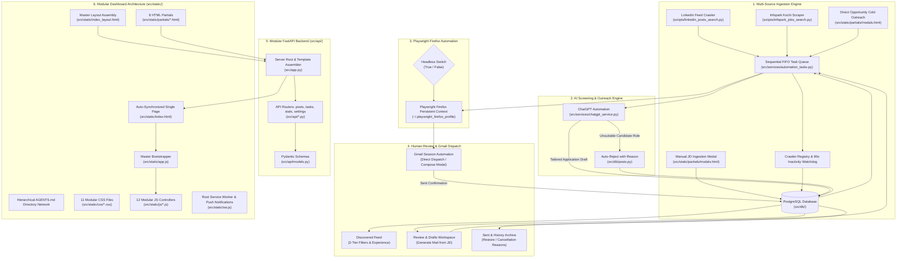

# Project File Architecture & Reference Guide

This document describes the exact role, inputs, outputs, and status of every file in the project. It serves as the single source of truth for the codebase architecture and is maintained continuously as new modules are developed.

---

## High-Level System Architecture & Data Flow

---

## Detailed File Registry

### 1. Root & Workspace Routing Guides

| File Path | Description & Core Responsibility | Status |
| :--- | :--- | :---: |
| [`AGENTS.md`](file:///Users/apple/Byten/linkedInScrapper/AGENTS.md) | **Root AI Agent Navigation Guide & Feature Routing Matrix**. Maps every UI component and API to its exact HTML partial, modular CSS file, JS module, and Python backend module to eliminate expensive search steps. | **Active & Maintained** |
| [`.agents/rules/codebase_map.md`](file:///Users/apple/Byten/linkedInScrapper/.agents/rules/codebase_map.md) | Workspace-level rule automatically loaded by Antigravity IDE, directing agents to modular files and safety protocols. | **Active & Maintained** |
| [`run.py`](file:///Users/apple/Byten/linkedInScrapper/run.py) | Server entrypoint script. Launches FastAPI application via Uvicorn on port 8000, bound to `0.0.0.0` for local network phone access. | **Active & Verified** |
| [`requirements.txt`](file:///Users/apple/Byten/linkedInScrapper/requirements.txt) | Python dependencies (`fastapi`, `uvicorn`, `playwright`, `psycopg2-binary`, `python-dotenv`). | **Active** |
| [`config.example.json`](file:///Users/apple/Byten/linkedInScrapper/config.example.json) | Template configuration with sample keyword searches, custom GPT URLs, and resume file paths. | **Active** |
| [`config.json`](file:///Users/apple/Byten/linkedInScrapper/config.json) | Local active user configuration file (git-ignored for user privacy). | **Active** |

---

### 2. Backend Application Core & API Routers (`src/` & `src/api/`)

| File Path | Description & Core Responsibility | Key Endpoints / Symbols | Status |
| :--- | :--- | :--- | :---: |
| [`src/app.py`](file:///Users/apple/Byten/linkedInScrapper/src/app.py) | Root FastAPI application. Handles CORS, no-cache headers, dynamic HTML compilation (`get_rendered_index_html`), static asset mounting, and `/sw.js` proxying. | `app`, `get_rendered_index_html` | **Active & Verified** |
| [`src/config.py`](file:///Users/apple/Byten/linkedInScrapper/src/config.py) | Settings manager synchronizing `config.json` and PostgreSQL `settings` table bidirectionally. | `load_config`, `save_config`, `get_headless_setting`, `set_headless_setting` | **Active & Verified** |
| [`src/api/AGENTS.md`](file:///Users/apple/Byten/linkedInScrapper/src/api/AGENTS.md) | API Router directory guide mapping all REST routes to endpoints and schemas. | Router Registry | **Active & Maintained** |
| [`src/api/__init__.py`](file:///Users/apple/Byten/linkedInScrapper/src/api/__init__.py) | API package aggregator assembling sub-routers into a unified `api_router`. | `api_router` | **Active & Verified** |
| [`src/api/models.py`](file:///Users/apple/Byten/linkedInScrapper/src/api/models.py) | Pydantic request and response schemas for all API routes. | `ManualPostRequest`, `DirectOutreachRequest`, `PostUpdateRequest`, `RejectRequest`, etc. | **Active & Verified** |
| [`src/api/posts.py`](file:///Users/apple/Byten/linkedInScrapper/src/api/posts.py) | Job post CRUD operations, manual JD submission, spam marking, status changes, and reason listings. | `/api/posts`, `/api/posts/manual`, `/api/posts/{id}/spam`, `/api/reasons`, `/api/locations` | **Active & Verified** |
| [`src/api/tasks.py`](file:///Users/apple/Byten/linkedInScrapper/src/api/tasks.py) | Task queue monitoring, crawler triggers, batch dispatch, and sequential queue controls. | `/api/tasks/status`, `/api/tasks/queue/cancel/{id}`, `/api/scrape`, `/api/generate-email/{id}` | **Active & Verified** |
| [`src/api/stats.py`](file:///Users/apple/Byten/linkedInScrapper/src/api/stats.py) | Real-time counters, analytics timelines, notification events, and system health status. | `/api/stats`, `/api/analytics`, `/api/health`, `/api/notifications` | **Active & Verified** |
| [`src/api/settings.py`](file:///Users/apple/Byten/linkedInScrapper/src/api/settings.py) | Settings configuration retrieval, updates, and 1-click Headless mode switch. | `/api/settings`, `/api/settings/headless`, `/api/resume/upload` | **Active & Verified** |

---

### 3. Database Layer (`src/db/`)

| File Path | Description & Core Responsibility | Key Functions | Status |
| :--- | :--- | :--- | :---: |
| [`src/db/AGENTS.md`](file:///Users/apple/Byten/linkedInScrapper/src/db/AGENTS.md) | Database subpackage guide mapping tables, queries, filters, and schema rules. | DB Architecture | **Active & Maintained** |
| [`src/db/__init__.py`](file:///Users/apple/Byten/linkedInScrapper/src/db/__init__.py) | Package root exporting all database functions for backward compatibility. | Unified Re-exports | **Active & Verified** |
| [`src/db/connection.py`](file:///Users/apple/Byten/linkedInScrapper/src/db/connection.py) | PostgreSQL connection pool, schema initialization, and safe cursor context manager. | `get_db_connection`, `get_db_cursor`, `init_db` | **Active & Verified** |
| [`src/db/settings.py`](file:///Users/apple/Byten/linkedInScrapper/src/db/settings.py) | Key-value settings queries backed by PostgreSQL `settings` table. | `get_setting`, `set_setting`, `get_all_settings` | **Active & Verified** |
| [`src/db/posts.py`](file:///Users/apple/Byten/linkedInScrapper/src/db/posts.py) | Post ingestion, deduplication, search/filtering, pagination, anti-spam heuristics, and lifecycle state changes. | `upsert_post`, `get_posts_paginated`, `mark_post_sent`, `mark_post_spam`, `update_post_email` | **Active & Verified** |
| [`src/db/analytics.py`](file:///Users/apple/Byten/linkedInScrapper/src/db/analytics.py) | Aggregated pipeline metrics, daily velocity timelines, rejection reason breakdowns, and source distributions. | `get_stats`, `get_analytics_summary`, `get_rejection_reasons_with_counts` | **Active & Verified** |

---

### 4. Services & Automation Layer (`src/services/`)

| File Path | Description & Core Responsibility | Key Functions / Classes | Status |
| :--- | :--- | :--- | :---: |
| [`src/services/AGENTS.md`](file:///Users/apple/Byten/linkedInScrapper/src/services/AGENTS.md) | Services subpackage guide mapping task engines, browser connectors, and workers. | Services Index | **Active & Maintained** |
| [`src/services/__init__.py`](file:///Users/apple/Byten/linkedInScrapper/src/services/__init__.py) | Package root exporting all service classes and task handlers. | Unified Re-exports | **Active & Verified** |
| [`src/services/automation_tasks.py`](file:///Users/apple/Byten/linkedInScrapper/src/services/automation_tasks.py) | Thread-safe sequential FIFO task queue engine (`TaskManager`), pluggable `SCRAPER_REGISTRY`, 90s watchdog, batch ChatGPT generator, and direct Gmail dispatcher. | `TaskManager`, `task_manager`, `SCRAPER_REGISTRY`, `run_chatgpt_batch`, `run_direct_gmail_send` | **Active & Verified** |
| [`src/services/chatgpt_service.py`](file:///Users/apple/Byten/linkedInScrapper/src/services/chatgpt_service.py) | Web ChatGPT orchestrator navigating to user's Custom GPT, typing JD into ProseMirror editor with natural human delays, awaiting streaming completion, and capturing tailored application drafts. | `navigate_to_conversation`, `send_jd_and_get_email`, `parse_email_response` | **Active & Verified** |
| [`src/services/firefox_connector.py`](file:///Users/apple/Byten/linkedInScrapper/src/services/firefox_connector.py) | Playwright Firefox persistent context manager (`~/.playwright_firefox_profile`). Handles headed/headless switching via `get_headless_mode()`, eliminates stale lock files, and preserves authenticated logins. | `launch_firefox_context`, `get_headless_mode`, `cleanup_stale_profile_locks` | **Active & Verified** |
| [`src/services/gmail_service.py`](file:///Users/apple/Byten/linkedInScrapper/src/services/gmail_service.py) | Gmail automation service providing both interactive compose drafting and 1-click automated direct dispatch with resume attachment. | `populate_email_draft`, `send_email_directly` | **Active & Verified** |
| [`src/services/health_service.py`](file:///Users/apple/Byten/linkedInScrapper/src/services/health_service.py) | Real-time session probe checking persistent cookie validity for LinkedIn, ChatGPT, Gmail, Infopark, and PostgreSQL. | `check_firefox_session_cookies`, `check_database_health`, `get_system_health` | **Active & Verified** |
| [`src/services/experience_extractor.py`](file:///Users/apple/Byten/linkedInScrapper/src/services/experience_extractor.py) | Regex and NLP parser extracting Years of Experience (YOE) requirements, freshers, ranges, and seniority levels from unstructured job text. | `extract_experience` | **Active & Verified** |
| [`src/services/chrome_connector.py`](file:///Users/apple/Byten/linkedInScrapper/src/services/chrome_connector.py) | Chrome DevTools Protocol connector. (Firefox persistent context is preferred to avoid Cloudflare Turnstile blocks on ChatGPT). | `connect_to_chrome` | **Fallback / Reference** |
| `src/*.py` shims | Backward-compatibility shims re-exporting `automation_tasks`, `chatgpt_service`, `firefox_connector`, `gmail_service`, `health_service`, `experience_extractor`, `chrome_connector` to support legacy script imports. | Shims | **Active & Verified** |

---

### 5. Frontend Client JavaScript Modules (`src/static/js/` & `src/static/app.js`)

| File Path | Description & Contained Logic | Key Exported Global Functions / State |
| :--- | :--- | :--- |
| [`src/static/js/AGENTS.md`](file:///Users/apple/Byten/linkedInScrapper/src/static/js/AGENTS.md) | Client JavaScript modules directory guide and symbol routing index. | Architecture Index |
| [`src/static/app.js`](file:///Users/apple/Byten/linkedInScrapper/src/static/app.js) | Main application bootstrapper. Initializes service worker, parses hash route, loads configuration and initial tab views. | `DOMContentLoaded` coordinator |
| [`src/static/js/state.js`](file:///Users/apple/Byten/linkedInScrapper/src/static/js/state.js) | Centralized client state stores: active tab, filter settings, pagination, task polling timers. | `currentTab`, `currentFilters`, `reviewQueue` |
| [`src/static/js/utils.js`](file:///Users/apple/Byten/linkedInScrapper/src/static/js/utils.js) | Shared helper utilities: date formatting, text escaping, clipboard copy, source badges, debounce. | `formatDate`, `escapeHtml`, `copyToClipboard` |
| [`src/static/js/notifications.js`](file:///Users/apple/Byten/linkedInScrapper/src/static/js/notifications.js) | Notification center dropdown, Web Audio chime synthesis, haptic feedback, Web Push registration. | `showToast`, `playChime`, `initNotifications` |
| [`src/static/js/sidebar.js`](file:///Users/apple/Byten/linkedInScrapper/src/static/js/sidebar.js) | Collapsible sidebar toggle (68px/270px), tab switching, badge counters, mobile drawer management. | `toggleSidebarCollapse`, `switchTab`, `updateSidebarBadgeCounts` |
| [`src/static/js/api.js`](file:///Users/apple/Byten/linkedInScrapper/src/static/js/api.js) | Fetch API wrapper handling error propagation, JSON parsing, and standard HTTP requests. | `fetchApi`, `postApi` |
| [`src/static/js/discovered.js`](file:///Users/apple/Byten/linkedInScrapper/src/static/js/discovered.js) | Discovered jobs table rendering, search inputs, experience chips, 2-tier dropdowns, sorting, and pagination. | `loadDiscoveredPosts`, `filterPosts`, `renderPostsTable` |
| [`src/static/js/review.js`](file:///Users/apple/Byten/linkedInScrapper/src/static/js/review.js) | Review workspace split view, candidate queue, draft editing, and `[ ✨ Generate Mail from JD ]` handler. | `loadReviewQueue`, `renderReviewItem`, `generateEmailFromJd` |
| [`src/static/js/history.js`](file:///Users/apple/Byten/linkedInScrapper/src/static/js/history.js) | Sent and cancelled outreach tables, dynamic rejection reason chips, post restoration actions. | `loadSentPosts`, `filterSentHistory`, `restorePost` |
| [`src/static/js/crawler.js`](file:///Users/apple/Byten/linkedInScrapper/src/static/js/crawler.js) | Crawler source selection, location input, and triggering crawler tasks. | `triggerSelectedCrawl`, `handleCrawlerSourceChange` |
| [`src/static/js/tasks.js`](file:///Users/apple/Byten/linkedInScrapper/src/static/js/tasks.js) | Live task progress drawer polling, terminal log stream rendering, task cancellation. | `pollActiveTasks`, `renderTaskTerminal`, `cancelQueueTask` |
| [`src/static/js/modals.js`](file:///Users/apple/Byten/linkedInScrapper/src/static/js/modals.js) | All 7 dialog modals: Post details, settings, add manual JD, direct cold outreach, cancel reasons, help. | `openPostModal`, `openSettingsModal`, `openAddJdModal` |
| [`src/static/js/analytics.js`](file:///Users/apple/Byten/linkedInScrapper/src/static/js/analytics.js) | Analytics dashboard initialization, KPI summary cards, Chart.js line/donut graphs, Headless mode toggle. | `fetchAnalyticsSummary`, `renderCharts`, `toggleHeadlessMode` |

---

### 6. Modular CSS Stylesheets (`src/static/css/`)

| File Path | Description & Contained Styles |
| :--- | :--- |
| [`src/static/css/AGENTS.md`](file:///Users/apple/Byten/linkedInScrapper/src/static/css/AGENTS.md) | Complete CSS selector, token, and class reference guide. |
| [`src/static/css/variables.css`](file:///Users/apple/Byten/linkedInScrapper/src/static/css/variables.css) | Design tokens, color palette (`--accent-primary`, `--bg-body`, etc.), typography, border radii. |
| [`src/static/css/base.css`](file:///Users/apple/Byten/linkedInScrapper/src/static/css/base.css) | CSS reset, base typography, standard buttons (`.btn`, `.btn-primary`), pills, badges, loading skeletons. |
| [`src/static/css/layout.css`](file:///Users/apple/Byten/linkedInScrapper/src/static/css/layout.css) | Stationary 100vh app shell, topbar, activity bell, and notification dropdown. |
| [`src/static/css/sidebar.css`](file:///Users/apple/Byten/linkedInScrapper/src/static/css/sidebar.css) | Collapsible navigation sidebar (68px collapsed / 270px expanded), 44x44 icon buttons, badges, crawler source card. |
| [`src/static/css/dashboard.css`](file:///Users/apple/Byten/linkedInScrapper/src/static/css/dashboard.css) | KPI metric summary cards, Chart.js analytics containers, and Headless mode switch toggle. |
| [`src/static/css/discovered.css`](file:///Users/apple/Byten/linkedInScrapper/src/static/css/discovered.css) | Search toolbar, experience pills, 2-tier filter dropdowns, table layout, snippet preview, pagination. |
| [`src/static/css/review.css`](file:///Users/apple/Byten/linkedInScrapper/src/static/css/review.css) | Review queue, candidate card, natural scrolling post container, draft body textarea, `btn-generate-mail-jd`. |
| [`src/static/css/history.css`](file:///Users/apple/Byten/linkedInScrapper/src/static/css/history.css) | Sent and cancelled outreach tables, rejection reason pills, restoration buttons. |
| [`src/static/css/tasks.css`](file:///Users/apple/Byten/linkedInScrapper/src/static/css/tasks.css) | Task drawer queue, progress bar, cancel buttons, and streaming terminal log window. |
| [`src/static/css/modals.css`](file:///Users/apple/Byten/linkedInScrapper/src/static/css/modals.css) | Safe-fitting modal dialogs (`max-height: calc(100vh - 3rem)`), pinned headers/footers, toasts. |
| [`src/static/css/responsive.css`](file:///Users/apple/Byten/linkedInScrapper/src/static/css/responsive.css) | Media queries (`<= 1024px`, `<= 768px`, `<= 480px`), off-canvas mobile drawer, touch cards. |

---

### 7. Component HTML Partials (`src/static/partials/`)

| File Path | Contained Component & Elements |
| :--- | :--- |
| [`src/static/partials/AGENTS.md`](file:///Users/apple/Byten/linkedInScrapper/src/static/partials/AGENTS.md) | Component partials directory guide and element ID registry. |
| [`src/static/partials/sidebar.html`](file:///Users/apple/Byten/linkedInScrapper/src/static/partials/sidebar.html) | Brand header, crawler source selector, navigation buttons with dynamic badge counts, active resume pill. |
| [`src/static/partials/topbar.html`](file:///Users/apple/Byten/linkedInScrapper/src/static/partials/topbar.html) | Sidebar toggle button, page title/breadcrumb, Add JD button, Direct Outreach button, Notification Center bell. |
| [`src/static/partials/task_drawer.html`](file:///Users/apple/Byten/linkedInScrapper/src/static/partials/task_drawer.html) | Live task progress drawer, sequential queue list with cancel buttons, streaming log terminal. |
| [`src/static/partials/tab_analytics.html`](file:///Users/apple/Byten/linkedInScrapper/src/static/partials/tab_analytics.html) | Dashboard overview, top KPI metrics cards, Headless on/off switch, Chart.js analytics graphs. |
| [`src/static/partials/tab_discovered.html`](file:///Users/apple/Byten/linkedInScrapper/src/static/partials/tab_discovered.html) | Search toolbar, experience filters, multi-tier dropdowns, Discovered jobs table, pagination controls. |
| [`src/static/partials/tab_review.html`](file:///Users/apple/Byten/linkedInScrapper/src/static/partials/tab_review.html) | Review & Drafts workspace, candidate queue, side-by-side post and draft body with Generate Mail from JD button. |
| [`src/static/partials/tab_sent.html`](file:///Users/apple/Byten/linkedInScrapper/src/static/partials/tab_sent.html) | Sent & Cancelled applications archive, dynamic reason filters, post restore actions. |
| [`src/static/partials/modals.html`](file:///Users/apple/Byten/linkedInScrapper/src/static/partials/modals.html) | All 7 modal dialogs: Post Details (`#postModal`), Settings, Add JD, Direct Outreach, Rejection Reason, Crawl Summary, Notification Help. |

---

### 8. Background Crawlers & Scripts (`scripts/`)

| File Path | Description & Core Responsibility |
| :--- | :--- |
| [`scripts/AGENTS.md`](file:///Users/apple/Byten/linkedInScrapper/scripts/AGENTS.md) | Background crawlers and standalone scripts navigation guide. |
| [`scripts/linkedin_posts_search.py`](file:///Users/apple/Byten/linkedInScrapper/scripts/linkedin_posts_search.py) | Primary LinkedIn search scraper navigating feed posts, extracting recruiter contacts with 90s inactivity watchdog. |
| [`scripts/infopark_jobs_search.py`](file:///Users/apple/Byten/linkedInScrapper/scripts/infopark_jobs_search.py) | Infopark Kochi tech park portal scraper ingesting daily software engineering job posts. |
| [`scripts/process_posts_with_chatgpt.py`](file:///Users/apple/Byten/linkedInScrapper/scripts/process_posts_with_chatgpt.py) | Standalone CLI script for batch processing pending JDs through ChatGPT. |
| [`scripts/prepare_gmail_draft.py`](file:///Users/apple/Byten/linkedInScrapper/scripts/prepare_gmail_draft.py) | Standalone CLI script for launching headed Gmail with populated draft and resume attachment. |

---

### 9. Documentation Directory (`docs/`)

| File Path | Description & Core Responsibility |
| :--- | :--- |
| [`docs/AGENTS.md`](file:///Users/apple/Byten/linkedInScrapper/docs/AGENTS.md) | Documentation directory guide and knowledge base index. |
| [`docs/file_architecture.md`](file:///Users/apple/Byten/linkedInScrapper/docs/file_architecture.md) | This file — complete system file architecture, roles, and status. |
| [`docs/implementation_plan.md`](file:///Users/apple/Byten/linkedInScrapper/docs/implementation_plan.md) | System implementation plan, account safety rules, and milestones. |
| [`docs/workflows.md`](file:///Users/apple/Byten/linkedInScrapper/docs/workflows.md) | In-depth technical workflows, DOM selectors, session persistence, and anti-spam heuristics. |
